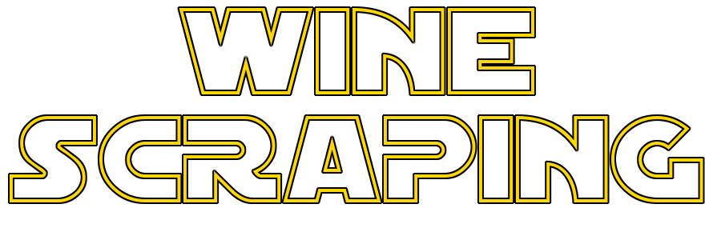
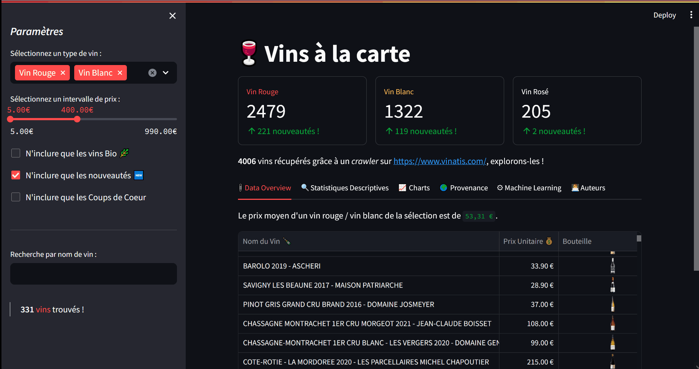
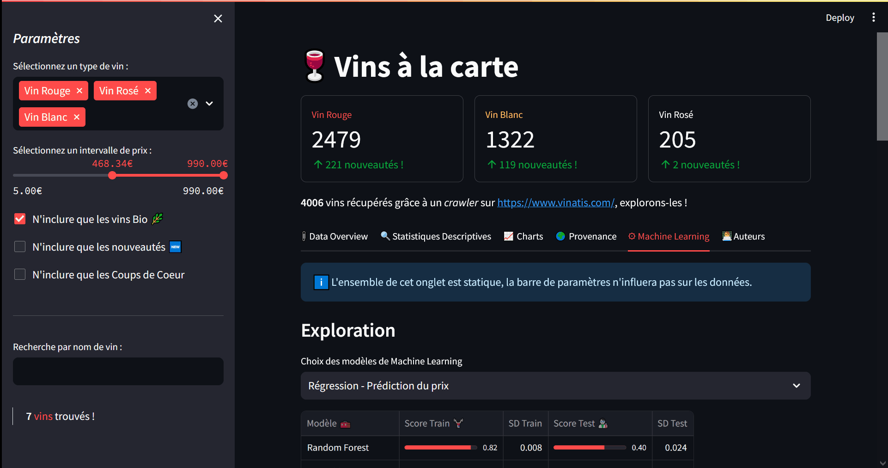

# 🍷 Wine-Scraping

> *Il y a bien longtemps, dans une campagne lointaine, très lointaine...*



*Le terroir est en guerre ! Menant une lutte acharnée pour l'information viticole, une bataille épique se déroule entre les données dissimulées et les amateurs assoiffés de connaissances sur le vin. Le chaos règne alors que les sources d'informations viticoles sont assaillies par des obstacles inattendus.*

*Avec une audace stupéfiante, les sites de revente de vin ont érigé des barrières insurmontables, empêchant l'accès aux détails les plus précieux sur les cépages, les millésimes et les appellations. La quête de ces informations devient une mission désespérée, une véritable lutte pour la liberté de l'information œnologique.*

*Face à cette situation, deux valeureux Chevaliers de la programmation Python s'élèvent pour secourir les amateurs de vin, menant une mission périlleuse pour libérer les données captives. Avec bravoure, ils s'attaquent aux défenses numériques pour délivrer les précieuses informations contenues dans les pages web tentaculaires...*

## Table des matières

- [🍷 Wine-Scraping](#-wine-scraping)
  - [Table des matières](#table-des-matières)
  - [Description](#description)
  - [Scraping](#scraping)
  - [Machine Learning](#machine-learning)
  - [Résultats du Machine Learning](#résultats-du-machine-learning)
  - [Installation](#installation)
  - [Utilisation de l'application](#utilisation-de-lapplication)
    - [Onglet 1 : Data Overview](#onglet-1--data-overview)
    - [Onglet 2 : Statistiques Descriptives](#onglet-2--statistiques-descriptives)
    - [Onglet 3 : Charts](#onglet-3--charts)
    - [Onglet 4 : Provenance](#onglet-4--provenance)
    - [Onglet 5 : Machine Learning](#onglet-5--machine-learning)
  - [Auteurs](#auteurs)
  - [Licence](#licence)
  - [TODO à retirer plus tard](#todo-à-retirer-plus-tard)


## Description 

L'objectif de ce projet est de récupérer des données sur un site web, les stocker, les transformer puis les exploiter pour faire des modèles de Machine Learning ainsi qu'une application.

**En ce sens, ce projet présente plusieurs étapes** :

1. Scraping des données avec `requests` et  `bs4` ♨
2. Restructuration des données avec `polars` 🐻
3. Création de pipelines de *Machine Learning* avec `sklearn` 🤖
4. Alimentation d'une base de données contenant les prédictions des modèles avec `duckdb` 💾
5. Création d'une application pour visualiser les résultats avec `streamlit` et `plotly` 📊

**Il répond aussi à un certain nombre de normes de production et de reproductibilité** :

1. Annotations de type claires 
2. Des *docstrings* compréhensibles, avec exemples
3. Gestion des dépendances et environnement virtuel avec `poetry`
4. Modularité du projet, entièrement versionné sur **Git**
5. Projet testé avec `pytest` et `pytest-cov`
6. Docker

## Scraping

La récupération des données se déroule en plusieurs étapes. Tout d'abord :

1. On construit les URL des pages de recherche proprement avec *query parameters* en utilisant le package `yarl`.

```python
URL_INIT = URL.build(scheme="https", host="vinatis.com")
WHITE = "achat-vin-blanc"
RED = "achat-vin-rouge"
ROSE = "achat-vin-rose"

>>> URL_INIT / WHITE % {"page": 1, "tri": 7}
... URL('https://vinatis.com/achat-vin-blanc?page=1&tri=7')
```

2. `create_session` crée une session HTML avec un User-Agent et un Proxy aléatoire, pouvant changer entre les requêtes.
3. Un décorateur `@random_waiter(min, max)` permet de générer un temps d'attente aléatoire entre les deux bornes spécifiées entre chaque requête **GET** pour éviter d'envoyer trop de requêtes dans un laps de temps réduit.
4. `create_all_wine_urls` permet de créer l'ensemble des liens **href**.
5. `export_wine_links` permet d'exporter ces liens dans un fichier CSV.

*Note : Chaque lien **href** récupéré correspond à la page d'un vin.*

> Toutes ces étapes peuvent être éxécutées grâce au script `page_scraper.py` si on souhaite uniquement récupérer les liens des pages pour effectuer les requêtes plus tard.

Il ne suffit plus maintenant que de requêter ces liens pour récupérer les informations brutes des pages, en extraire des attributs de valeur et utiliser une `@dataclass` sérialisable en **JSON** pour stocker les informations.

> Si les liens ont déjà été scrapés, alors lancer le script `wine_scraper.py` permettra de le faire.

*Voici un exemple des caractéristiques d'un vin au format JSON :*


```json
{
        "name": "PINOT NOIR 2019 LAS PIZARRAS - ERRAZURIZ",
        "capacity": "0,75 L",
        "price": "94,90 €",
        "price_bundle": null,
        "characteristics": "Vin Rouge / Chili / Central Valley / Aconcagua Valley DO / 13,5 % vol / 100% Pinot noir",
        "note": null,
        "keywords": [
            "Elégance",
            "Finesse",
            "Harmonie"
        ],
        "others": null,
        "picture": "https://www.vinatis.com/67234-detail_default/pinot-noir-2019-las-pizarras-errazuriz.png",
        "classification": null,
        "millesime": "2019",
        "cepage": "100% Pinot noir",
        "gouts": "Rouge Charnu et fruité",
        "par_gouts": "Puissant",
        "oeil": "Robe rubis aux reflets violets.",
        "nez": "Nez complexe sur la griotte, les épices et les champignons (truffe).",
        "bouche": "Bouche fruitée et florale. Tanins structurés, élégants et fins. finale harmonieuse et persistante.",
        "temperature": "8-10°C",
        "service": "En bouteille ou en carafe",
        "conservation_1": "2026",
        "conservation_2": "A boire et à garder",
        "accords_vins": "Apéritif, Entrée, Charcuterie, Viande rouge, Viande blanche, Volaille, Gibier, Champignon, Barbecue, Cuisine du monde, Fromage, Dessert fruité, Dessert chocolaté",
        "accords_reco": "Gigot d'agneau aux herbes de Provence; Tikka massala; Plateau de fromages."
    }
```

Il est cependant possible de faire tourner la procédure complète une fois dans l'environnement virtuel du projet avec la commande : 

```powershell
python -m "src.modules.scraping_trigger"
```

## Machine Learning

La procédure de Machine Learning se déroule en plusieurs étapes :

1. Il y a deux variables à prédire : *unit_price* & *type*
2. Nous utiliserons 6 modèles de **Machine Learning**
3. ➶ Optimisation des hyperparamètres par Cross-Validation $\Rightarrow$ `models.py`
4. 🏹 Prédiction sur les données de test $\Rightarrow$ `prediction.py`
5. 🧪 Utilisation d'un **pipeline** `sklearn`
    - Evite le Data Leakage.
    - Procédure standardisée pour l'ensemble des modèles.

Les **21 variables explicatives** sont les suivantes : 

| **Variable**        | **Type** | **Description**                                                 |
| ------------------- | -------- | --------------------------------------------------------------- |
| `name`              | str      | _Nom du vin_                                                    |
| `capacity`          | float    | _Capacité en litres du vin_                                     |
| `millesime`         | int      | _Année de vendange des raisins_                                 |
| `cepage`            | str      | _Type de raisin utilisé pour confectionner le vin_              |
| `par_gouts`         | str      | _Classification par goûts du vin_                               |
| `service`           | str      | _Comment se sert le vin_                                        |
| `avg_temp`          | float    | _Température moyenne de conservation du vin_                    |
| `conservation_date` | int      | _Date de conservation maximale du vin après achat_              |
| `bio`               | bool     | _Indique si le vin est issu de l'agriculture biologique_        |
| `customer_fav`      | bool     | _Indique si le vin est un coup de coeur client_                 |
| `is_new`            | bool     | _Indique si le vin est une nouveauté sur le site_               |
| `top_100`           | bool     | _Indique si le vin fait partie d'un classement dans le top 100_ |
| `destock`           | bool     | _Indique si le vin est en déstockage_                           |
| `sulphite_free`     | bool     | _Indique si le vin est sans sulfites_                           |
| `alcohol_volume`    | float    | _Degré de concentration d'alcool_                               |
| `country`           | str      | _Pays d'origine du vin_                                         |
| `bubbles`           | bool     | _Indique si le vin a des bulles_                                |
| `wine_note`         | float    | _Indique la note sur 5 du vin_                                  |
| `nb_reviews`        | int      | _Nombre de commentaires_                                        |
| `conservation_time` | float    | _Durée de conservation du vin en années_                        |
| `cru`               | bool     | _Indique si le vin est un grand cru_                            |

## Résultats du Machine Learning

5 tables de résultats de Machine Learning sont obtenues grâce à l'éxéuction de `ml_trigger` qui se charge d'éxécuter l'ensemble des scripts d'export.Mais plutôt que d'utiliser chaque csv indépendamment ou de tenter de concaténer les résultats, nous avons préféré utiliser une base de données.

`duckdb` est une base de données particulière en ce sens qu'elle n'est pas *Client-Server*, mais *in-memory*. Cela permet d’obtenir des temps de réponse minimaux en éliminant le besoin d'accéder à des unités de disque standard (SSD). Une base de données *in-memory* est donc idéale pour une application effectuant de l’analyse de données en temps réel.

*Voici un schéma du processus d'ingestion des tables :*

```mermaid
graph LR;
A("👨‍🔬 pred_classification")-->F;
B("👨‍🔬 pred_regression")-->F;
C("👩‍🏫result_ml_regression")-->F;
D("👩‍🏫 result_ml_classification")-->F;
E("🕵️‍♂️ importance")-->F[("🦆 In Memory Database")];

style A stroke:#adbac7,stroke-width:3px, fill:#222222;
style B stroke:#adbac7,stroke-width:3px, fill:#222222;
style C stroke:#adbac7,stroke-width:3px, fill:#222222;
style D stroke:#adbac7,stroke-width:3px, fill:#222222;
style E stroke:#adbac7,stroke-width:3px, fill:#222222;
style F stroke:#fff100,stroke-width:3px, fill:#222222;
```



Voici comment lancer la *trigger* une fois dans l'environnement virtuel du projet (pas nécessaire pour faire fonctionner l'application car les tables existent déjà): 

```powershell
python -m "src.modules.ml_trigger"
```

*Attention, le temps d'éxécution moyen peut considérablement varier selon la machine utilisée !*

## Installation

En utilisant Visual Studio Code, il suffit de lancer le `git bash` avec <kbd>ctrl+ù</kbd>.

Ensuite, il faut cloner le dépôt avec la commande :

```bash
$ git clone https://github.com/CDucloux/Wine-Scraping.git
```

- Toutes les dépendances sont contenues dans le *pyproject.toml* généré par `poetry`

La commande suivante se chargera d'installer l'ensemble de ces dépendances dans l'environnement virtuel dédié du projet :

```powershell
py -m poetry install
```


Il faut ensuite lancer le shell poetry :

```powershell
py -m poetry shell
```

Une fois dans le shell, pour lancer l'application, il faut simplement faire : 

```powershell
python -m streamlit run "src/modules/app/streamlit_app.py"
```

***

🎉 Félicitations, vous devriez voir apparaitre le message suivant dans le terminal et l'application se lancer dans le navigateur !

```powershell
  You can now view your Streamlit app in your browser.

  Local URL: http://localhost:8501
```


## Utilisation de l'application

L'application dispose d'une barre latérale permettant de filtrer les résultats, et possède 6 onglets ayant des fonctions différentes.

> Tous les onglets partagent aussi les métriques statiques sur le nombre de vins par type **(Vin rouge, blanc et rosé)**.

### Onglet 1 : Data Overview

- [x] Sidebar utilisable

Le premier onglet de l'application contient les données sous forme de tableau filtrable grâce à la barre latérale. Il est possible pour l'utilisateur d'étudier une multitude d'informations :

- Nom du vin
- Prix unitaire
- Image de la bouteille
- Capacité en litres
- Type de vin
- Millésime
- Durée de conservation
- Mots-clés associés
- Cépage Majoritaire
- Vin bio
- Nouveauté
- Coup de coeur client
- Destockage
- Service
- Température moyenne
- Degré d'alcool
- Description
- Goûts / A l'oeil / Au nez / En bouche
- Pays d'origine du vin
- Note du vin

*Démonstration :*



### Onglet 2 : Statistiques Descriptives

- [ ] Sidebar utilisable

L'onglet 2 permet quant à lui d'obtenir un aperçu rapide d'une analyse exploratoire de données :

- L'histogramme des prix
- La matrice des corrélations
- Un diagramme en barres des cépages majoritaires

*Démonstration :*


### Onglet 3 : Charts

- [x] Sidebar utilisable

Le troisième onglet se focalise sur le lien entre le prix unitaire d'un vin et sa durée de conservation. Il est possible de sélectionner l'échelle et des régressions locales *LOESS* sont affichées pour chaque type de vin.

*Démonstration :*


### Onglet 4 : Provenance

- [x] Sidebar utilisable

Ce quatrième onglet permet de visualiser une carte de la provenance des vins ainsi qu'une indication du nombre de vins commercialisés par pays. *(Soyons honnêtes, c'est plus pour le style qu'autre chose.)*

*Démonstration :*


*NB : Etant donné que le revendeur est français, il est évident que le nombre de vins commercialisés par la France est prépondérant.*

### Onglet 5 : Machine Learning

- [ ] Sidebar utilisable

Ce cinquième onglet est probablement le plus complexe et le plus intéressant. Il se décline en 3 parties :

- **Exploration**
- **Investigation**
- **Prédiction**

*Démonstration :*



**Exploration** permet de comparer le score d'entrainement et le score de test des 6 modèles de Machine Learning pour vérifier si il y a un problème de sur-apprentissage.

***


**Investigation** approfondit l'exploration en ayant accès aux hyperparamètres optimaux de chaque modèle. En plus, selon le mode sélectionné (*classification* ou *régression*), différentes métriques d'évaluation s'affichent :

- Pour la *classification* $\Rightarrow$ Accuracy, Precision, Recall, $F_1$ score, $MCC$ (Coefficient de corrélation de Matthews), Rapport de classificatiton et Matrice de Confusion.

- Pour la *régression* $\Rightarrow$ $MAE$ (Erreur Absolue Moyenne), $MSE$ (Erreur Quadratique Moyenne), $R^2$, Erreur Résiduelle Maximale.

Enfin, pour les modèles de **Boosting** et de **Random Forest**, l'importance relative des variables dans le modèle est disponible graphiquement.


***


**Prédiction** permet à l'utilisateur de choisir un vin sur lesquels les modèles n'ont pas été entrainés. En bonus, la bouteille de vin est même visualisée 😉. 

Ensuite, il peut choisir entre la prédiction du prix ou bien la classification du type de vin, et à la fin, sélectionner le modèle pour effectuer la prédiction !

**Celle-ci est ensuite comparée à la réalité, avec un indicateur permettant de vérifier si il y a une correspondance.**

***

Pour la prédiction du prix, pour que la prédiction soit considérée comme *"acceptable"*, il faut que le prix prédit soit compris entre :

$$0.8 \times unit\textunderscore price_{\text{true}} < unit\textunderscore price_{\text{true}} < 1.2 \times unit\textunderscore price_{\text{true}}$$

- C'est à dire entre 80 et 120% du prix réel.

Ce seuil est évidemment discutable car il n'est pas extrêmement précis pour les vins à prix elevé, néanmoins, pour les vins à bas prix, les écarts ne sont pas anormalement elevés. 

## Auteurs

- *[Corentin DUCLOUX](https://github.com/CDucloux)*
- *[Guillaume DEVANT](https://github.com/devgui37)*

## TODO à retirer plus tard

- [ ] Commencer à faire les tests unitaires et d'intégration et pytest coverage + doctest pour les tests dans les docstrings.

- **Phase de tests unitaires, éventuellement Docker**

- [ ] Voir tests unitaires dans des docstrings $\Rightarrow$ `doctest`


***
