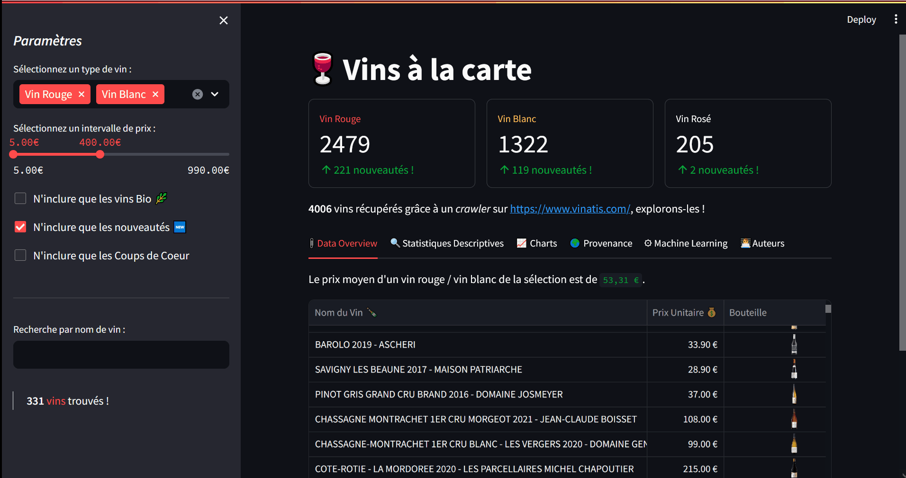

# Wine-Scraping

## <u>Table of Contents</u>
- [DataQuality](#dataquality)
  - [Table of Contents](#table-of-contents)
  - [Description](#description)
  - [Model](#model)
  - [Package structure](#package-structure)
  - [Explanations](#explanations)
  - [Dependencies Management](#dependencies-management)
  - [Virtual Environment](#virtual-environment)
  - [Usage](#usage)
    - [*Manual export*](#manual-export)
    - [*Automated export*](#automated-export)
  - [Modifications](#modifications)
  - [Testing 🐱‍🚀](#testing-)
  - [Roadmap 🗺](#roadmap-)
  - [Authors 🖋](#authors-)

## Description 

Pour lancer un script sans avoir l'erreur **src : Module not Found** :

```powershell
py -m src.modules.ml_models.models
```

Pour lancer le shell poetry :

```powershell
py -m poetry shell
```

Une fois dans le shell, pour lancer l'appli, il faut **ABSOLUMENT** faire : 

```powershell
python -m streamlit run  'd:\Cours Mecen 
(M2)\Machine Learning\Wine Scraping\src\modules\app\streamlit_app.py'
```

Pour installer les dépendances dans l'environnement virtuel :

```powershell
py -m poetry install
```

Pour lister les packages installés dans le venv

```powershell
py -m poetry pip list/freeze
```

<kbd>ctrl+A</kbd> $\Rightarrow$ shortcut keyboard



- [ ] Commencer à faire les tests unitaires et d'intégration et pytest coverage + doctest pour les tests dans les docstrings.
- [ ] Faire `Docker`

> Plan :

- **Scraping**
    - `scraping_functions` $\Rightarrow$ module finalisé
    - `scraper` $\Rightarrow$ module finalisé (récupère les hrefs des vins et les écrit dans un fichier csv)

- **Soup & JSON**
    - `mystical_soup` $\Rightarrow$ module finalisé (Transforme en les résultats trouvés dans les pages html à l'aide de *BeautifulSoup*)

- **Polars & Restructuration tabulaire**
    - `bear_cleaner` $\Rightarrow$ module finalisé (Transfomr le json brurt en format tabulaire exploitable)

- **Machine Learning**
    - `models` $\Rightarrow$ module finalisé (Prépare les modèles)
    - `prediction` $\Rightarrow$ module finalisé (Applique les modèles et fait les prédictions)

- **Base de données** : Alimentation d'une DB in memory suite au cleaning avec polars

- **Application** : Création d'une appli avec Dash ou Streamlit

- **Phase de tests unitaires, check MYPY, environnements virtuels, poetry, re-documentation & éventuellement Docker**

- [ ] Voir tests unitaires dans des docstrings $\Rightarrow$ `doctest`